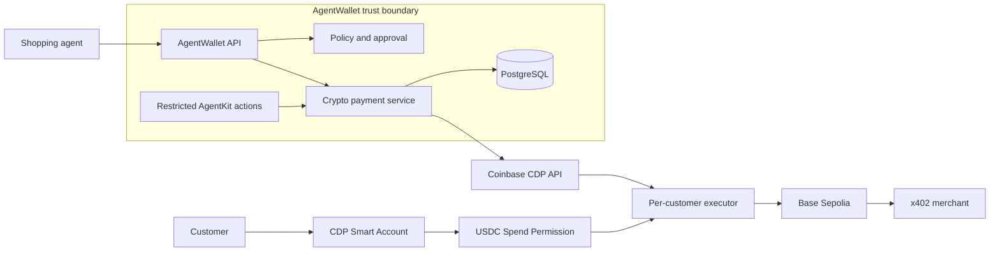
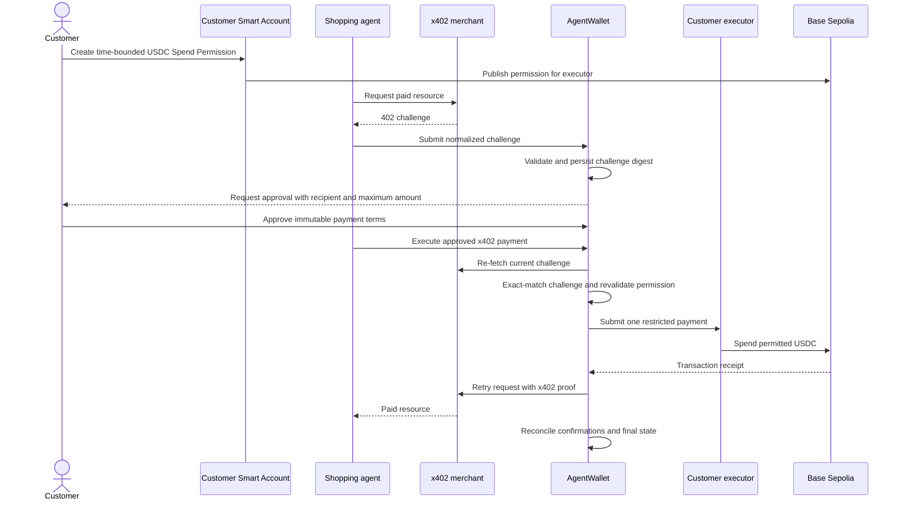

# ADR 001: Coinbase crypto payment rail

- **Status:** Accepted
- **Date:** 2026-08-19
- **Decision owners:** AgentWallet maintainers
- **Related issues:** #166, #187-#200

## Context

AgentWallet currently pays merchants through Stripe Issuing. Crypto payments have
different authorization, custody, settlement, and failure semantics and therefore
must not be represented as another `IPaymentProvider` implementation. That
interface models card issuance and reveal-once card credentials; forcing an
onchain transfer through it would hide material security decisions.

The first launch must let a customer authorize a bounded amount of crypto without
giving an agent an unrestricted wallet key. AgentWallet must be able to execute an
approved x402 payment while preserving the existing rule that approval is specific
to one intent, one merchant request, and one maximum amount.

## Decision

The first Coinbase rail is deliberately narrow:

| Dimension | First-launch choice |
| --- | --- |
| Network | Base Sepolia (`84532`) |
| Asset | Testnet USDC only |
| Customer wallet | Customer-controlled CDP Smart Account |
| Executor | Dedicated CDP EVM account per AgentWallet customer |
| Delegation | Onchain, time-bounded USDC Spend Permission |
| Approval | AgentWallet approval tied to an immutable x402 challenge |
| Protocol | x402 `exact` scheme only |
| Agent integration | Restricted AgentKit custom action provider |

The customer wallet remains the source of funds. The per-customer executor can
spend only within the permission recorded onchain. AgentKit is an orchestration
surface, not an authorization boundary: every action must call the crypto payment
service, which revalidates approval, permission, network, asset, recipient, amount,
expiry, and challenge identity immediately before submission.

### Component boundaries

The crypto payment service owns Coinbase account lookup, permission validation,
x402 challenge normalization, transaction submission, and reconciliation. Existing
Stripe modules remain unchanged. Shared intent and approval contracts may be
extended, but card-specific objects such as `VirtualCard` are never reused for
onchain transactions.

### Trust boundaries and enforcement

| Rule | Primary enforcement | Defense in depth |
| --- | --- | --- |
| Executor cannot exceed the delegated USDC amount or expiry | Spend Permission contract | AgentWallet preflight validation |
| Only an approved payment may execute | AgentWallet database and state machine | AgentKit exposes no raw send/sign action |
| Recipient, amount, asset, network, and x402 scheme cannot change after approval | Immutable challenge digest in AgentWallet | Re-fetch and exact comparison before signing |
| A payment is submitted at most once | AgentWallet idempotency record | Stable CDP idempotency key and onchain reconciliation |
| API credentials cannot authorize arbitrary customer funds | Per-customer onchain permission | Least-privilege CDP key and isolated executor accounts |
| Settlement is final only after sufficient confirmations | Base transaction receipt | Reconciliation job handles reorgs and ambiguous submissions |

CDP credentials establish access to managed executor accounts. They do not replace
customer consent or the onchain Spend Permission. Application checks protect the
workflow, while the permission contract limits the damage possible if an agent or
worker attempts an out-of-policy transfer.

### Payment sequence

Approval is invalid if any material challenge field changes. The customer must see
and approve the final recipient, asset, network, amount ceiling, and expiry. A new
challenge creates a new approval flow rather than mutating the approved record.

## Credential ownership and lifecycle

| Credential or key | Owner | Storage | Rotation and recovery |
| --- | --- | --- | --- |
| Customer Smart Account signer | Customer / CDP user-wallet system | Never stored by AgentWallet | Customer completes CDP recovery; AgentWallet cannot export it |
| CDP API key ID and private key | AgentWallet operator | Deployment secret manager only | Rotate with overlapping keys, verify health, then revoke old key |
| CDP wallet secret | AgentWallet operator | Deployment secret manager only | Generate a replacement in CDP, roll deployment, verify account access, revoke old secret |
| Per-customer executor key | CDP wallet platform | Not exported or logged by AgentWallet | Recover through CDP account APIs; revoke Spend Permission if access is uncertain |

The CDP API key receives only permissions required to manage non-custodial backend
accounts. Private-key export is prohibited. Secrets must be independently scoped by
environment, redacted from logs and errors, and unavailable to shopping agents.
Suspected credential compromise requires disabling crypto execution, revoking all
active permissions, rotating CDP credentials, and reconciling every pending payment
before re-enabling the rail.

### Runtime and SDK boundary

The backend runs on Node.js 22 and remains a CommonJS TypeScript application. CDP
SDK 1.55.0 is pinned in the lockfile and provides a supported CommonJS entry point
and root type declaration. Retaining the existing module format avoids breaking
Stripe type imports and the current Jest/ts-node toolchain. A repository-wide ESM
migration is unrelated to the crypto rail and requires a separate compatibility
change. Coinbase SDK imports are limited to the future crypto module described in
#189 and #193; AgentKit is not installed until its restricted adapter in #198 has
an immediate consumer.

Only the CDP SDK root entry point is reachable today. The repository still uses the
legacy `moduleResolution: "node"` algorithm, which ignores a package's `exports` map,
and the SDK publishes `./auth` and `./x402` through `exports` alone. The root import
resolves because the package also declares `main` and `types`; the subpaths do not.
Moving to `node16` resolution first requires replacing the seven Stripe modules that
import from `stripe/cjs/*`, which resolve only under the legacy algorithm. #214 tracks
that migration and blocks the x402 execution work in #196.

CDP SDK 1.55.0 pins an Axios release affected by published security advisories.
The root package therefore overrides that transitive dependency to patched Axios
1.19.0. This override must remain until Coinbase publishes a CDP SDK whose own
dependency range resolves to a patched release; removing it requires a production
dependency audit and CDP authentication smoke test.

## Threat model and required response

| Threat or failure | Required control or response |
| --- | --- |
| Prompt injection or malicious agent | No raw wallet tools; strict action schema; server-side policy and approval checks on every execution |
| Compromised worker credential | Worker identity is not payment authority; require approved challenge plus valid onchain permission; revoke worker credential and permissions |
| Replay or duplicate job | Unique execution idempotency key and compare-and-set state transition; reconcile an existing hash instead of resubmitting |
| Merchant changes the x402 challenge | Re-fetch and compare the canonical digest; fail closed and require new approval |
| AgentWallet backend compromise | Onchain amount, token, spender, and expiry remain the last-resort limit; revoke permissions and rotate all operator credentials |
| CDP outage or timeout | Do not infer failure; mark submission ambiguous and reconcile before retrying |
| RPC disagreement or ambiguous receipt | Query independent RPC/CDP sources; keep payment pending until the configured confirmation policy is met |
| Chain reorganization | Treat early receipts as provisional and return to pending when the canonical receipt disappears |
| Insufficient USDC or gas | Fail preflight without submitting; surface a customer-actionable funding error |
| Expired or revoked permission | Fail closed before signing; require a new permission and approval when payment terms also change |

## Rejected alternatives

1. **Give AgentKit a general-purpose wallet tool.** This makes prompt injection a
   direct signing risk and bypasses AgentWallet approval semantics.
2. **Use one executor for every customer.** A shared hot account broadens the blast
   radius, makes revocation ambiguous, and weakens audit attribution.
3. **Model crypto as `IPaymentProvider`.** Card issuance, credential reveal, x402
   challenge binding, transaction finality, and onchain permission checks are not
   interchangeable operations.
4. **Start with mainnet or arbitrary tokens/chains.** This multiplies operational,
   liquidity, and policy risk before the idempotency and reconciliation path has
   production evidence.

## Consequences

- Crypto requires its own contracts, persistence, state transitions, worker flow,
  and reconciliation path.
- Coinbase SDK calls stay behind the crypto payment service; AgentKit actions
  cannot import or instantiate CDP clients directly.
- Every customer needs wallet onboarding, a funded Base account, testnet USDC, and
  an active permission before an agent can pay.
- Base Sepolia is the only enabled network until the mainnet gate is approved.

## Mainnet gate

Enabling Base mainnet requires a separate architecture and security review. At a
minimum, the following evidence must exist:

- external review of Spend Permission creation and execution paths;
- passing replay, changed-challenge, revocation, timeout, and reorg tests;
- production secret-manager integration and a rehearsed credential rotation;
- alerting and runbooks for ambiguous, stuck, rejected, and reverted payments;
- reconciliation metrics showing no unexplained balance or state divergence;
- per-payment and per-customer risk limits with an emergency global kill switch;
- legal, compliance, sanctions, and supported-region approval;
- explicit maintainer sign-off on asset contract addresses, confirmation depth,
  RPC/CDP dependencies, and staged rollout limits.

No environment variable alone may switch the application to mainnet. Mainnet
support requires a reviewed code change after these conditions are met.
