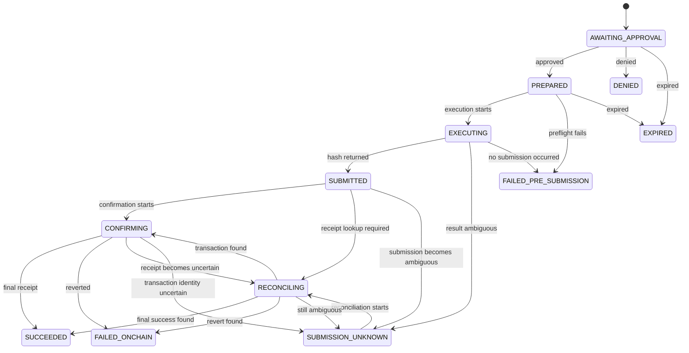

# Crypto payment domain model

This document implements the persistence boundary selected in
[ADR 001](./001-coinbase-crypto-payment-rail.md). It defines crypto payment
state without changing the existing Stripe card lifecycle.

## Aggregate ownership

`PurchaseIntent.paymentRail` selects the execution family. Existing and omitted
values resolve to `CARD`, so pre-migration intents and current Stripe write paths
retain their behavior. Crypto does not implement `IPaymentProvider` and does not
create or reuse `VirtualCard`, `Pot`, or card settlement records.

The crypto aggregate consists of:

| Model | Responsibility |
| --- | --- |
| `CryptoWalletAccount` | Binds one customer wallet and one isolated CDP executor to a user and network |
| `CryptoSpendPermission` | Records the onchain token allowance, spender, validity window, and last observed state |
| `CryptoPayment` | Stores one immutable x402 request and its execution lifecycle |

The first-launch enums deliberately admit only Base Sepolia and x402. Supporting
another network or protocol requires a migration and reviewed execution logic; an
environment variable cannot silently widen the accepted domain.

## Amount representation

Human display values and settlement values are separate fields:

- `displayCurrency` and nullable `displayAmount` describe what the customer saw;
- `assetSymbol`, `tokenAddress`, and `tokenDecimals` identify the token;
- `amountAtomic` is the exact unsigned integer submitted onchain.

Atomic amounts use `DECIMAL(78,0)` and `Prisma.Decimal`. They must never pass
through a JavaScript `number`. Display amounts are informational and cannot be
used to reconstruct the atomic amount.

## Immutable approval terms

The payment's intent, wallet, permission, protocol, network, amounts, token,
recipient, request digest, and execution idempotency key are immutable from
insert. Any changed merchant challenge creates a new payment and approval flow.
A database trigger enforces this rule for Prisma, workers, and direct SQL. Service
code receives these fields through readonly contracts and the transition service
only accepts an event, actor, and audit payload.

Insertion also proves that the intent uses the crypto rail and belongs to the
wallet owner. The permission must reference the same wallet, network, chain,
customer, executor, token, decimals, and a sufficient allowance.

## Execution lifecycle

Application compare-and-set updates prevent concurrent workers from applying the
same event twice. The database independently rejects skipped or terminal-state
transitions. A partial unique index permits at most one nonterminal crypto payment
per intent, while preserving terminal attempts as audit history. Request digests,
execution keys, transaction hashes, and user-operation hashes are independently
unique.

`submittedAt`, `confirmedAt`, `failedAt`, `reconciliationStartedAt`, and
`reconciledAt` distinguish submission, finality, failure, and reconciliation
timing. Every service transition writes an `AuditEvent` in the same transaction.

## Follow-on services

Wallet provisioning, permission synchronization, x402 validation, Coinbase
submission, confirmation, and reconciliation build on these records. They must
not bypass the transition service or expose unrestricted CDP signing primitives
to AgentKit actions.
